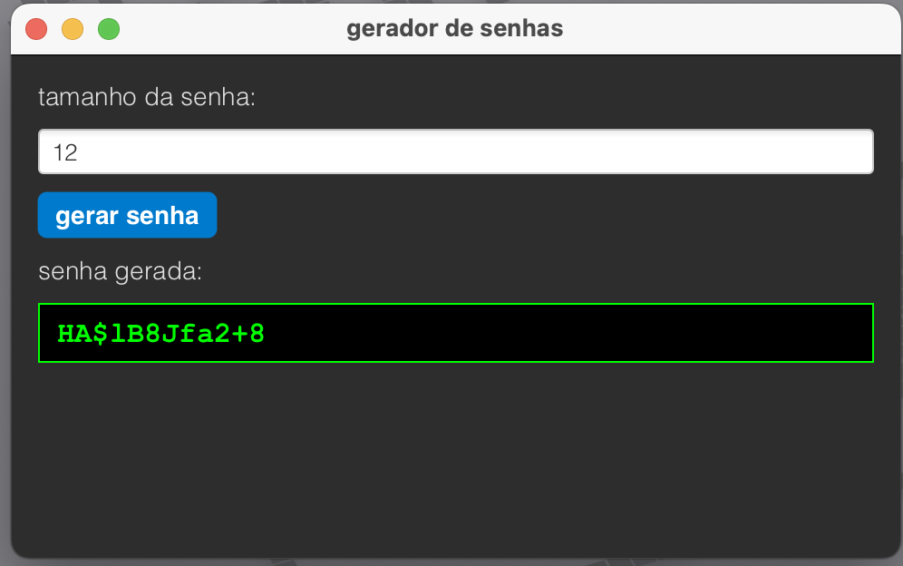

# Projeto Gerador de Senhas

## Introdução

Este projeto consiste em um Gerador de Senhas seguras desenvolvido em Java. A aplicação oferece duas formas de interação: uma interface gráfica moderna construída com JavaFX e uma versão mais simples para uso via terminal (linha de comando).

O objetivo principal foi criar uma ferramenta funcional e, acima de tudo, segura, utilizando recursos criptográficos nativos da plataforma Java para garantir que as senhas geradas sejam verdadeiramente aleatórias e imprevisíveis.

---
<p align="center">
  
</p>

---

## Tecnologias e Bibliotecas Utilizadas

A construção deste projeto se baseou em tecnologias padrão do ecossistema Java, escolhidas por sua robustez e segurança.

### Java
A linguagem de programação principal. Toda a lógica, tanto do backend quanto da interface, foi escrita em Java, aproveitando sua portabilidade e vasto conjunto de bibliotecas.

### JavaFX
Foi a biblioteca escolhida para a criação da Interface Gráfica do Usuário (GUI). JavaFX é um framework moderno para o desenvolvimento de aplicações ricas para desktop, permitindo a criação de interfaces responsivas e visualmente agradáveis. A estilização dos componentes foi feita através de CSS, o que demonstra a flexibilidade da plataforma.

### `java.security.SecureRandom`
Esta é a peça central da segurança do projeto. Para a geração de senhas, não basta apenas um número aleatório; é crucial que ele seja criptograficamente seguro.

- **Por que foi usada?** Diferente da classe `java.util.Random`, que gera números pseudoaleatórios previsíveis, a `SecureRandom` utiliza fontes de entropia do próprio sistema operacional (como movimentação do mouse, atividade de disco, etc.) para gerar números verdadeiramente aleatórios.
- **Segurança:** Isso garante que a sequência de caracteres escolhida para a senha não segue um padrão e é extremamente difícil de ser prevista, tornando as senhas geradas resistentes a ataques de força bruta e adivinhação.

### Javadoc
Toda a documentação do código-fonte foi gerada utilizando o padrão Javadoc. Esta prática é fundamental para a manutenibilidade do projeto, pois permite que outros desenvolvedores (ou o próprio autor no futuro) entendam rapidamente o propósito de cada classe e método sem precisar analisar toda a sua implementação.

## Estrutura do Projeto

O projeto foi organizado da seguinte forma para separar o código-fonte (`src`) dos arquivos compilados (`bin`):

```proprites
projeto-gerador-senha/
├── bin/
│ └── (Arquivos .class e .css compilados)
├── images/
│ └── foto.png
└── src/
│ └── ProjetoGeradorDeSenhas.java
│ └── ProjetoGeradorDeSenhasGUI.java
| └── styles.css
```

## Como Compilar e Executar

Para compilar e executar o projeto, você precisará ter o JDK (Java Development Kit) e o JavaFX SDK instalados e configurados em sua máquina.

### Pré-requisitos

1. **JDK (versão 11 ou superior)**
2. **JavaFX SDK (compatível com a sua versão do JDK)**

### Passo a Passo

1. **Defina a variável de ambiente para o JavaFX SDK** (este passo facilita os comandos seguintes). Substitua o caminho pelo local correto no seu sistema.

    ```bash
    export PATH_TO_FX=/caminho/para/seu/javafx-sdk/lib
    ```

2. **Compile os arquivos `.java`**. Este comando irá compilar os fontes da pasta `src` e colocar os arquivos `.class` na pasta `bin`.

    ```bash
    javac -d bin --module-path $PATH_TO_FX --add-modules javafx.controls src/*.java
    ```

3. **Copie o arquivo de estilo CSS** para o diretório de saída, para que a aplicação possa encontrá-lo.

    ```bash
    cp src/styles.css bin/
    ```

4. **Execute a Aplicação Gráfica (GUI)**.

    ```bash
    java -cp bin --module-path $PATH_TO_FX --add-modules javafx.controls ProjetoGeradorDeSenhasGUI
    ```

## Conclusão

O projeto "Gerador de Senhas" cumpre com sucesso seu objetivo de ser uma ferramenta prática e segura. Através dele, foi possível aplicar conceitos importantes de desenvolvimento de software, como a criação de interfaces gráficas com JavaFX, a documentação de código com Javadoc e, mais importante, o uso de APIs de segurança do Java (`SecureRandom`) para garantir a integridade e a robustez da solução.

## Autor

- **Gabriel Azevedo**  
- Engenharia de Computação - Universidade Federal de Uberlândia (UFU)  
- **Email:** gazevedo.ti@gmail.com
